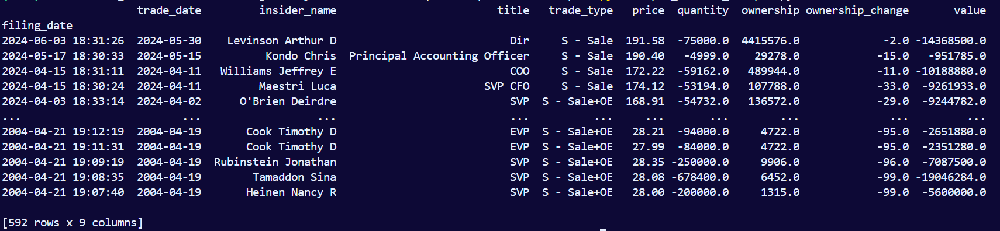
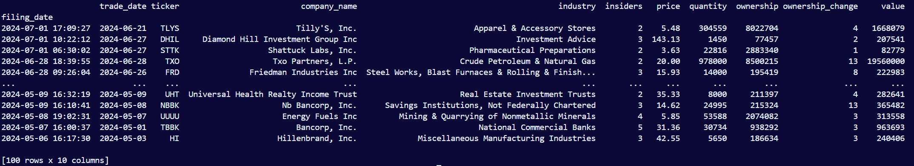
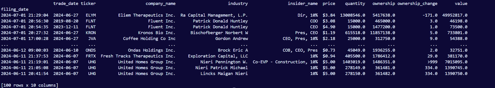

# OpenInsider Scraper

- Get latest insider trades for a specific stock.
- Get latest cluster buys by insiders.
- Get latest penny stock buys by insiders.

---

### Setup

1. Clone git repository: `https://github.com/Primitive-Coding/OpenInsiderScraper.git`

2. Install the projects requirements with `pip install -r requirements.txt`

---

### Instructions

- Create a class instance.
- Set `debug=True` if you want scraping to be logged.

```
    oi = OpenInsiderScraper()

    # Log data
    oi = OpenInsiderScraper(debug=True)


```

###### Latest Insider Trades by Ticker.

- Below is how to get the latest insider trades for a ticker.
- In this example we will be using `AAPL`.
- By default it will get the last 1,000 trades. If there are less than 1,000 trades, it will grab all available data.
- Data is saved locally in `InsiderData\Tickers\AAPL.csv`.
- If data does not exist, it will be scraped and then saved locally.
- These local files help reduce redundant scraping.
- However if you want to overwrite the local data with new data, set `update=True`.

```
    df = oi.get_insider_trades("AAPL")

    # If updates are wanted.
    df = oi.get_insider_trades("AAPL", update=True)
```



###### Latest Cluster Buys

- Get the latest cluster buys by insiders.
- Data is saved locally in `InsiderData\cluster_buys.csv`.
- To overwrite the local data with new data, set `update=True`.

```
    df = oi.get_cluster_buys()

    #df = oi.get_cluster_buys(update=True)
```



###### Latest Penny Stock Buys

```
    df = oi.get_penny_stock_buys()
```


